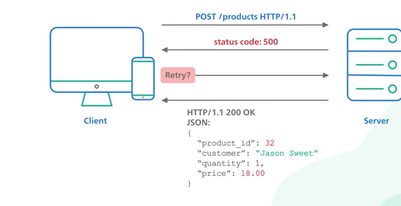

<h3>REST (REpresentational State Transfer)<h3>

  <h4>REST Rules</h4>

  Uniform Interface: This rule defines a uniform way to interact with resources. It is comprised of four constraints - Resource Identification in Requests, Resource Manipulation through Representations, Self-Descriptive Messages, and Hypermedia as the Engine of Application State (HATEOAS). This constraint ensures that clients and servers can interact with each other in a predictable and standardized way.

Client-Server: This rule separates the user interface concerns from the data storage concerns. It allows the client to focus on the presentation logic while the server focuses on data storage and management.

Stateless: This rule requires that the server should not store any client context. Each request from the client should contain all the necessary information for the server to understand and process the request.

Cacheability: This rule requires that responses from the server should be cacheable or non-cacheable based on the response characteristics. Caching can significantly improve the performance of a RESTful system.

Layered System: This rule allows the system to be layered. Each layer only interacts with the layer immediately below it and does not have knowledge of any other layers beyond that.

Code on Demand (Optional): This rule allows clients to execute code on demand from the server, such as in the form of applets or scripts. However, it is optional and not widely used in practice.

<h3>What is an API?</h3>
API stands for "Application Programming Interface". It is a set of protocols, tools, and standards that defines how software components should interact with each other.
An API allows different software components to communicate with each other, exchange data, and perform operations in a standardized way. APIs can be used to integrate different systems, enable third-party developers to access data and functionality from a service, or create custom applications that interact with a platform.
Typically, an API will define a set of endpoints or URLs that a client can use to interact with a server or service. Each endpoint will have a specific purpose, such as retrieving data, updating data, or performing a specific operation.

When a client makes a request to an API endpoint, it sends a request message that contains information about the operation to be performed and any required data. The server processes the request and sends back a response message that contains the result of the operation or an error message if the request could not be processed.

  <h3> REST VS GRAPHQL</h3>

Here are some of the key differences between REST and GraphQL:

Data fetching: With REST, clients typically make multiple requests to fetch related data. For example, if a client needs to display a list of products with their associated categories, it may need to make separate requests to fetch each product and its category. With GraphQL, clients can specify the exact data they need in a single request, which can reduce network overhead and improve performance.

Data structure: With REST, the structure of the response is typically determined by the server. Clients may need to parse and transform the response to fit their specific needs. With GraphQL, the client specifies the structure of the response, which can make it easier to work with the data.

Caching: With REST, clients can use HTTP caching to reduce network overhead by storing responses in a cache. With GraphQL, because the structure of the response can vary based on the query, caching can be more challenging.

Versioning: With REST, versioning is typically done by adding version numbers to the URI or using content negotiation. With GraphQL, versioning is typically done by adding new fields or types to the schema.

Tooling: GraphQL comes with a rich set of tools for exploring and testing APIs, generating client-side code, and more. REST has a larger ecosystem of tools, but they tend to be more specialized and less tightly integrated.

