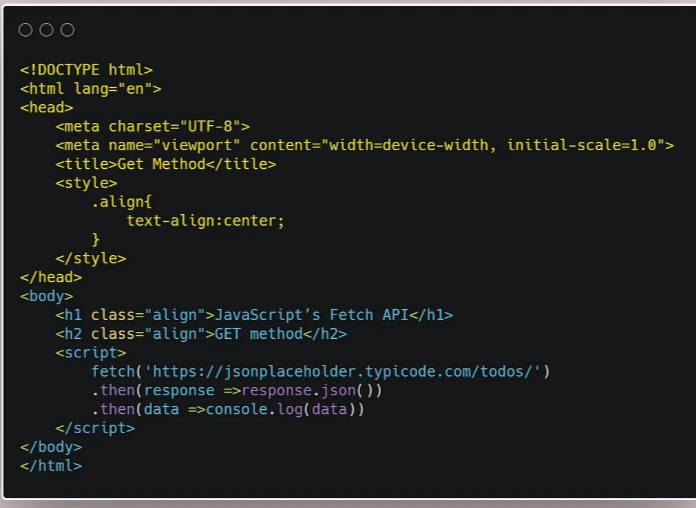

Create NEW record =>POST
read=>GET
If the record exists then update else create a new record=>PUT
update/modify=>PATCH
delete=>DELETE

<h4>The Get Method<h4>
Get method is used to retrieve or get the information from the given server using a given URL. In REST CURD, it performs the read operation.

<h4>The Post Method</h4>
Post is used for sending data to the server such as uploading a file or transferring some data or adding a new row to the back end table to any kind of web form. In a simple sentence, we can say that the post method is used for inserting new items in the backend server. In REST CRUD operation it performs the create operation.

<h4>The PUT Method</h4>
The PUT method is most often used to update an existing resource.

let’s try to understand the PUT method mechanism:

In HTTP.PUT method, the resource is first identified by the URL and if it exists, then it is updated, otherwise, a new resource is created. In simply we can say that If the resource exists then update else create a new resource.

<h4>THE PATCH METHOD</h4>
The PATCH method is used to update the values of the resource properties.

Before writing the code look at the below screenshot which is taken from the placeholder where userID:1 this userID has two property one is the title & another one is the completed. Respectively their values are ‘delectus aut autem’ & ‘false’.Here we are going to update the values of the resource properties.

patch

DELETE is used to delete a resource by its URL.

