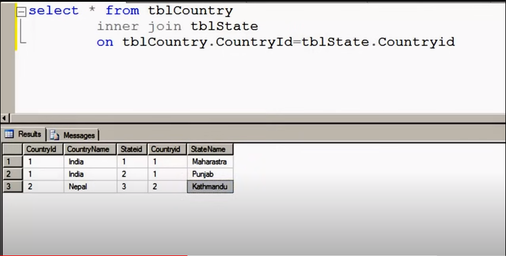
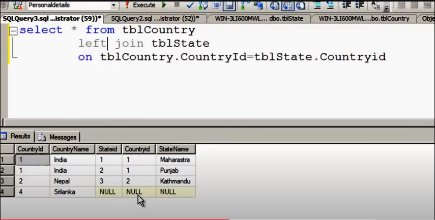
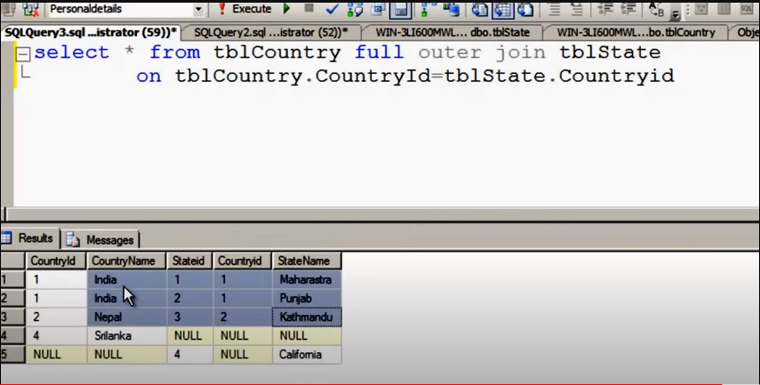

A JOIN clause is used to combine rows from two or more tables, based on a related column between them.

```SQL
SELECT Orders.OrderID, Customers.CustomerName, Orders.OrderDate
FROM Orders
INNER JOIN Customers ON Orders.CustomerID=Customers.CustomerID;
```
Different Types of SQL JOINs
Here are the different types of the JOINs in SQL:

(INNER) JOIN: Returns records that have matching values in both tables
LEFT (OUTER) JOIN: Returns all records from the left table, and the matched records from the right table
RIGHT (OUTER) JOIN: Returns all records from the right table, and the matched records from the left table
FULL (OUTER) JOIN: Returns all records when there is a match in either left or right table
```SQL
SELECT column_name(s)
FROM table1
INNER JOIN table2
ON table1.column_name = table2.column_name;
```


The LEFT JOIN keyword returns all records from the left table (table1), and the matching records from the right table (table2). The result is 0 records from the right side, if there is no match.
```SQL
SELECT column_name(s)
FROM table1
LEFT JOIN table2
ON table1.column_name = table2.column_name;
```


The FULL OUTER JOIN keyword returns all records when there is a match in left (table1) or right (table2) table records.

Tip: FULL OUTER JOIN and FULL JOIN are the same.
```SQL
SELECT column_name(s)
FROM table1
FULL OUTER JOIN table2
ON table1.column_name = table2.column_name
WHERE condition;
```


Self join
```SQL
SELECT A.CustomerName AS CustomerName1, B.CustomerName AS CustomerName2, A.City
FROM Customers A, Customers B
WHERE A.CustomerID <> B.CustomerID
AND A.City = B.City
ORDER BY A.City;
```
